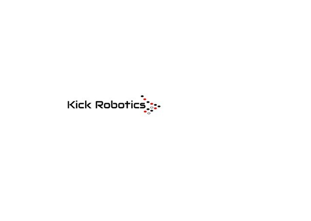
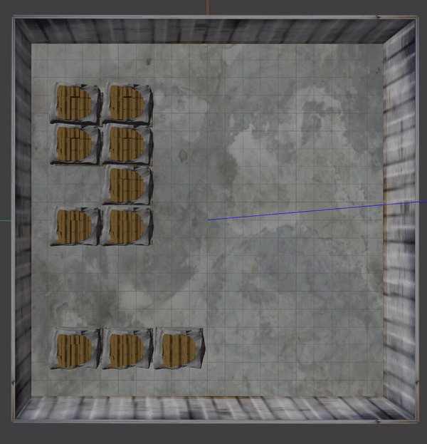
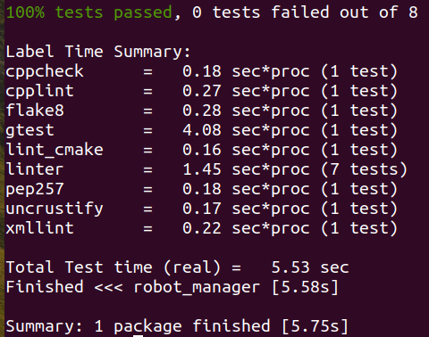
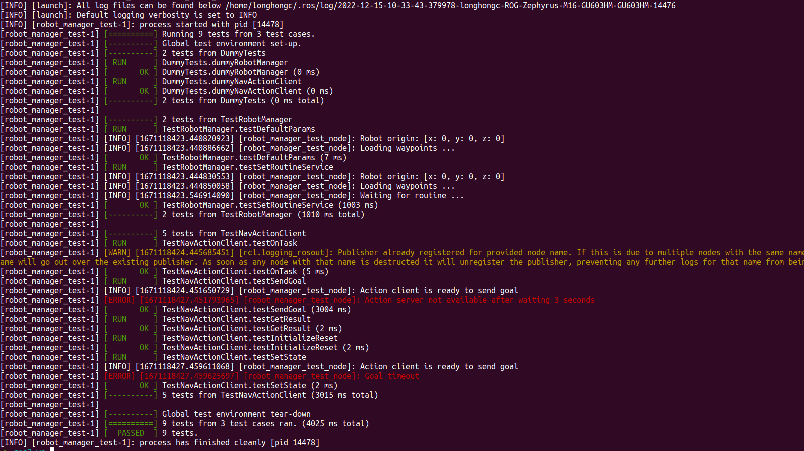
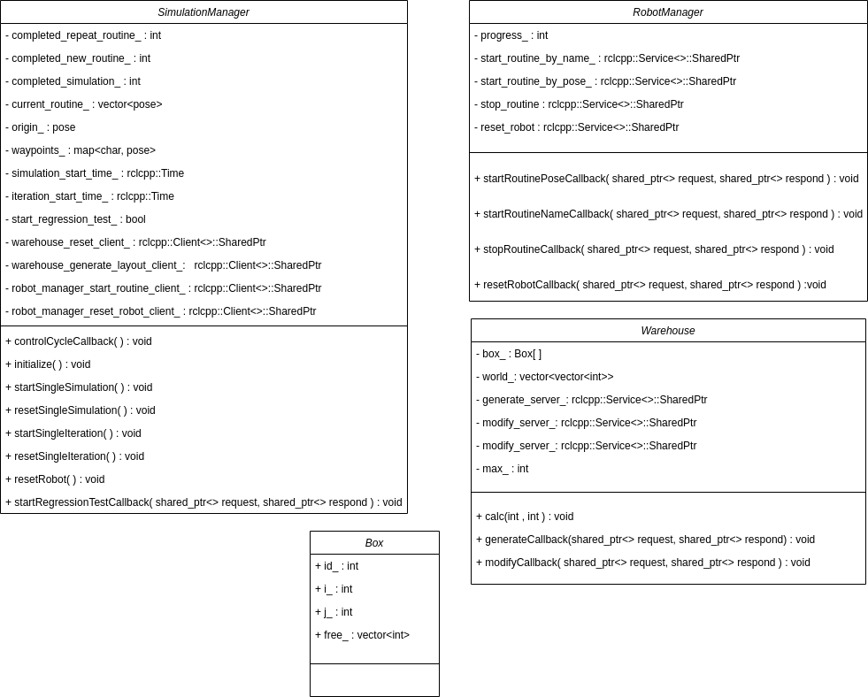

# Kick Warehouse Simulation
[](https://github.com/sj0897/kickWarehouseSim/actions/workflows/build_and_coveralls.yml)
[]

Direct testing of algorithms in the real world has huge costs and safety concerns associated with them. This is where simulation comes into picture. The agenda of this component is to create a software to automate simulation for evaluation of various algorithms that will be running on a wheeled robot.

<p float="left">
   
   
</p>

Robot in the warehouse simulation is provided by Kick Robotics, LLC. 
<p float="left">
   
   
</p>

**Author:**  
|Name|UID|Github account|
|-----|-----|-----|
|Chang-Hong Chen|117397857|longhongc|
|Sparsh Jaiswal|117433968|sj0897| 
|Po-Yu Huang |117684681|danielforever| 

### Table of contents
- [**Dependencies**](#dependencies) 
- [**Build**](#build) 
- [**Run**](#run) 
  - [**Routine Simulation**](#routine-simulation)
  - [**Warehouse Simulation**](#warehouse-simulation)
- [**Results**](#results)
- [**Test**](#test)
  - [**Robot Manager**](#robot-manager)
- [**Design**](#design) 

## Dependencies
### Environment
- ROS2 foxy
- Ubuntu 20.04
### ROS2 Packages
These packages are in the third_party folder
- [Nav2](https://github.com/ros-planning/navigation2/tree/foxy-devel)
- [slam_toolbox](https://github.com/SteveMacenski/slam_toolbox/tree/foxy-devel)

## Build
Clone this repository to the src folder in ros2 workspace
```
cd {ros2 workspace}/src
git clone https://github.com/sj0897/kickWarehouseSim.git
```
The dependencies packages (Nav2 and slam toolbox) can be installed in two ways.
1. Clone git submodule
```
cd {ros2 workspace}/src/kickWarehouseSim
git submodule update --recursive
```
2. With apt-tool
```
sudo apt install ros-foxy-gazebo-ros-pkgs
sudo apt install ros-<distro>-slam-toolbox
sudo apt install ros-<distro>-navigation2 ros-<distro>-nav2-bringup '~ros-<distro>-turtlebot3-.*'

```


Build the packages
```
cd {ros2 workspace}
colcon build
```

## Run 
### Routine Simulation
Start warehouse gazebo simulation
```
ros2 launch warehouse_simulation warehouse_simulation.launch.py
```
Start robot model, navigation system, and mapping
```
ros2 launch robot_model warehouse_bot.launch.py 
```
Start RVIZ for visualization
```
ros2 launch warehouse_simulation rviz2.launch.py 
```
Start robot manager
```
ros2 launch robot_manager robot_manager.launch.py 
```
Send routine request through service  
The waypoints in the routine are defined in robot_manager/config/waypoints.yaml
```
ros2 service call /set_routine robot_manager_msgs/srv/SetRoutine "{routine: [A, B, C]}"
```
Routine config example  
 

### Warehouse Simulation
The warehouse simulation generate a warehouse layout in the gazebo world on-the-fly.  
It provides service to add a custom degree of changes to the base layout.
```
ros2 launch warehouse_simulation e^Cty_warehouse.launch.py
ros2 run warehouse_simulation warehouse
ros2 service call /warehouse/Generate warehouse_simulation/srv/Modify "{a: 1}"
ros2 service call /warehouse/Modify warehouse_simulation/srv/Modify "{a: 5}"
```

## Results
Robot following a set of routine  
 

World Generation and Modification   
 

## Test
### Robot Manager
Run test
```
colcon test --event-handlers console_direct+ --packages-select robot_manager
```
 
Run only gtest and no style check

```
ros2 launch robot_manager test_robot_manager.launch.py   
```

 


## Design
### UML

 

### ROS Node Graph

 

### Link to AIP Documents
https://docs.google.com/spreadsheets/d/1jPUXeID2PA99P3RgWnmy4Ot1bprAT-mLDxvRTo3mwnE/edit?usp=sharing

### Link to Presentation
https://docs.google.com/presentation/d/1a7bCiWbXJOMIBw73r6T0CFLViDLNzy3EHOD3jxnlliw/edit?usp=sharing


## Known Issues
- Global map got cleared if unreachable  
https://github.com/ros-planning/navigation2/issues/1999
